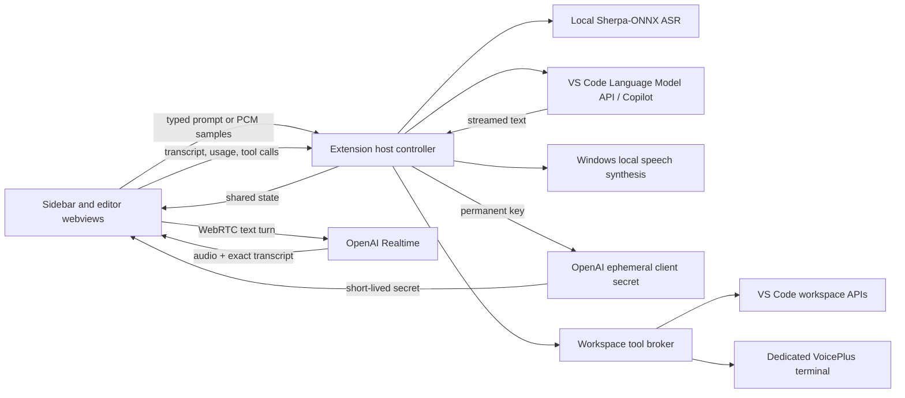
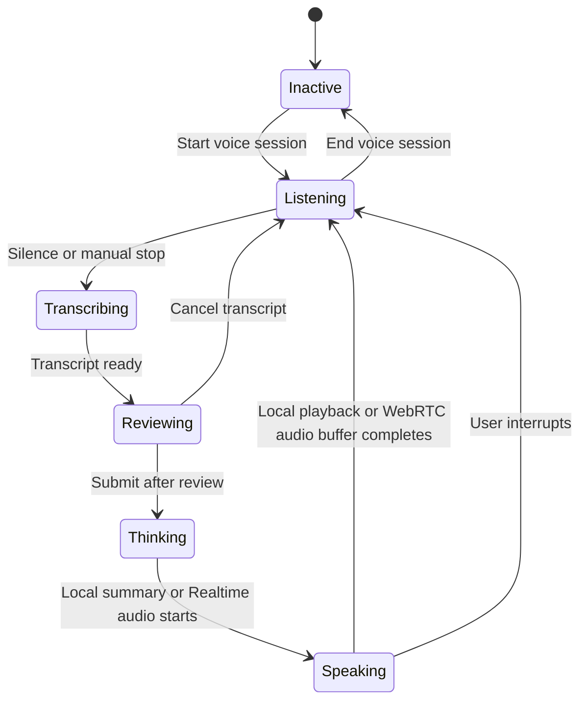

# VoicePlus Technical Specification

## Product Boundary

VoicePlus is an independent VS Code chat experience. It does not inject UI into built-in Copilot Chat, inspect built-in dictation state, or intercept another chat participant's traffic. Those capabilities are not exposed through stable extension APIs.

Version one targets stable VS Code on local Windows workspaces and is distributed privately as a VSIX from GitHub Releases.

## Agreed Behavior

- The Activity Bar sidebar and optional editor tab show the same selected conversation.
- Only one conversation may own a voice session at a time.
- The configurable shortcut opens VoicePlus and starts listening when needed.
- Silence completes a spoken turn; manual stop remains available.
- A transcript is editable for two seconds before submission. Approval phrases never use timed submission.
- Microsoft mode writes the full Copilot answer and speaks a concise Windows summary.
- OpenAI mode generates the answer and voice together; the displayed answer is the exact audio transcript.
- Pressing the microphone control during speech interrupts playback and starts listening.
- The model picker has an automatic fallback when a prior selection disappears.
- Microphone audio and transcription stay local in Microsoft mode. OpenAI mode streams PCM audio to Realtime, uses OpenAI input captions, and receives generated speech from OpenAI.
- OpenAI requires a user-supplied API key in Secret Storage and explicit per-workspace data-sharing consent.
- OpenAI failure or a session spending cutoff switches the conversation to the Microsoft/Copilot fallback.
- OpenAI voice sessions retain their webview runtime while another Activity Bar container is visible.
- Opening a different active editor sends a debounced, sensitive-file-filtered context update without prompting a model response.
- Read-only context retrieval is automatic and targeted. Sensitive files require explicit access.
- File changes always require approval of a displayed plan and expandable diff.
- Terminal commands require separate approval unless command auto-approve is active for that conversation.
- Command auto-approve never includes pushes, elevation, or destructive operations.
- No telemetry is collected. Audio is never persisted.

## Architecture

The extension host owns WASAPI microphone capture, silence detection, model access, conversation state, model installation, transcription, Windows speech playback, permissions, usage limits, and workspace tools. Sidebar and editor webviews receive snapshots from one controller rather than maintaining independent conversations. Extension webviews do not request microphone permission because VS Code's stable webview permission policy does not grant `media` access.

In OpenAI mode, the host mints a short-lived Realtime client secret with the permanent key from VS Code Secret Storage. One owning webview creates a WebRTC connection to `https://api.openai.com/v1/realtime/calls`. The extension host resamples native microphone PCM to 24 kHz and streams it over the Realtime data channel. Tool calls, input captions, authoritative output transcripts, and token usage return to the controller. The webview cannot access the permanent key or VS Code workspace APIs.

## Voice State Machine

The microphone stream is closed before transcription, model work, and playback. This prevents VoicePlus from transcribing its own voice and keeps Windows' microphone indicator accurate.

## Local Speech

The local speech stack uses:

- `sherpa-onnx` 1.13.5 WebAssembly runtime
- `@picovoice/pvrecorder-node` 1.2.9 with its prebuilt Windows x64 native recorder
- Moonshine Base English quantized model dated 2026-02-27
- Published archive size: 111,266,225 bytes
- Published SHA-256: `43232c1d13013d37317163baec3135bd771a186a4356f28c889bab453bb0e891`
- Windows `System.Speech.Synthesis.SpeechSynthesizer` for playback

The runtime ships inside the VSIX. The model downloads only after modal consent, is verified before extraction, and lives beneath `ExtensionContext.globalStorageUri`.

## OpenAI Realtime

- GA Realtime client-secret and WebRTC call endpoints
- Output modality set to audio; native microphone PCM is streamed as audio input
- Semantic server VAD owns speech boundaries, automatic responses, and interruption
- OpenAI input transcription captions user turns without replacing the original audio model input
- Realtime voice and response are generated together
- `response.output_audio_transcript` events are the sole displayed assistant text
- Realtime function calls reuse the existing read-only workspace and approval-gated action brokers
- Voice changes dispose the existing session because a Realtime voice cannot change after audio output starts
- Tracing is explicitly disabled
- Reported text, audio, and cached tokens feed an in-memory cost estimate and configurable session cutoff

## Security Model

- Stable VS Code APIs only; no workbench DOM patching or private context keys.
- Webviews use a restrictive content security policy and local resource roots.
- The webview network policy allows only the OpenAI API endpoint; only ephemeral Realtime credentials cross into browser code.
- Workspace Trust gates search, edits, and commands. Untrusted workspaces permit read-only chat with explicit attachments only.
- OpenAI is completely disabled in untrusted workspaces and supports a machine-scoped administrative disable setting.
- Per-workspace consent explains the current shared context and applicable OpenAI retention, residency, billing, and organization policy boundary.
- `.env`, key files, credentials, ignored files, and token-like data are excluded from automatic retrieval.
- Proposed edits are immutable approval batches. Changing a batch invalidates its approval.
- Voice approval, typed approval, and the approval button authorize only the displayed batch.
- A dedicated terminal makes commands visible. Secret prompts remain in the terminal and never enter model context.
- Conversation-scoped command auto-approve resets when the conversation or VS Code closes.
- Git pushes, elevation, and destructive commands remain outside auto-approve.
- Prompts, transcripts, audio, API keys, and tool arguments are not written to telemetry or extension logs.

## Implementation Status

### Voice Conversation: Implemented

- Custom sidebar and expanded editor chat
- Copilot model discovery, selection, and fallback
- Streaming responses and cancellation
- Verified local speech-model installation
- Microphone capture, silence detection, and transcript review
- Spoken-summary extraction and Windows playback
- Automatic turn-taking and interruption
- VSIX-ready production bundle
- OpenAI Realtime response and audio generation over WebRTC
- Exact spoken transcript streaming and cloud-speech interruption
- Secure API-key setup, workspace consent, privacy indicator, usage estimate, spending cutoff, and Microsoft fallback

### Workspace Context: Partially Implemented

Implemented:

- Active-selection, active-file, and chosen UTF-8 text-file attachments
- Automatic context from the active editor, including unsaved buffers
- Targeted workspace file listing, exact-text search, and file reads using VS Code workspace APIs
- Sensitive-path filtering and generated/dependency-folder exclusions for automatic retrieval
- Visible source labels for explicit, automatic, and tool-retrieved context

Planned:

- Multiple named conversations with one voice-session owner
- Folder, image, diagnostic, and terminal-output attachments
- Git ignore integration and explicit approval for sensitive-file access
- `AGENTS.md`, Copilot instruction-file, and personal-instruction discovery
- Collapsible tool activity
- Model capability checks and vision-model fallback
- Context compaction while preserving the visible transcript
- Optional per-workspace conversation persistence

The `voiceplus.instructions` and `voiceplus.chat.persistHistory` settings are declared in the extension manifest but are not connected to the controller yet.

### Approved Actions: Implemented

- Proposed edit batches with plain-language plans and expandable diffs
- Voice, typed, and button approval bound to an immutable batch ID
- Workspace edits and one-click undo where later changes do not conflict
- Dedicated visible VoicePlus terminal with captured, collapsible output
- Separately approved command batches and conversation-scoped auto-approve for the current single conversation
- Dangerous-command policy and Git-specific restrictions
- Post-edit test/build/lint proposals and result summaries through command batches
- Explicit Stop Task behavior for models, tools, and running commands

## Acceptance Checks

Each release must produce an installable VSIX and pass:

1. Type-check, lint, production bundle, and extension-host tests.
2. Light and dark theme visual checks in sidebar and editor layouts.
3. Microphone-denied, model-download-failed, no-Copilot-model, cancellation, and interrupted-speech paths.
4. A full local loop: listen, transcribe, review, stream, speak, and listen again.
5. No audio files or prompt contents in persistent logs or telemetry.
6. An OpenAI loop: configure, consent, submit local transcript, hear Realtime audio, verify exact captions, interrupt, and fall back after a forced disconnect.