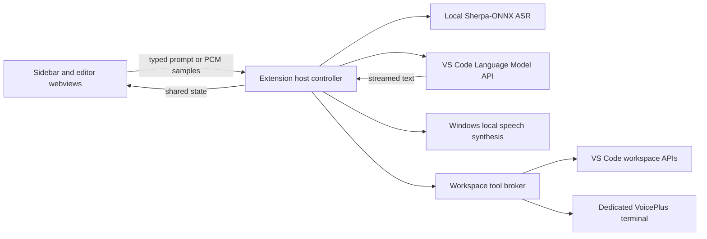
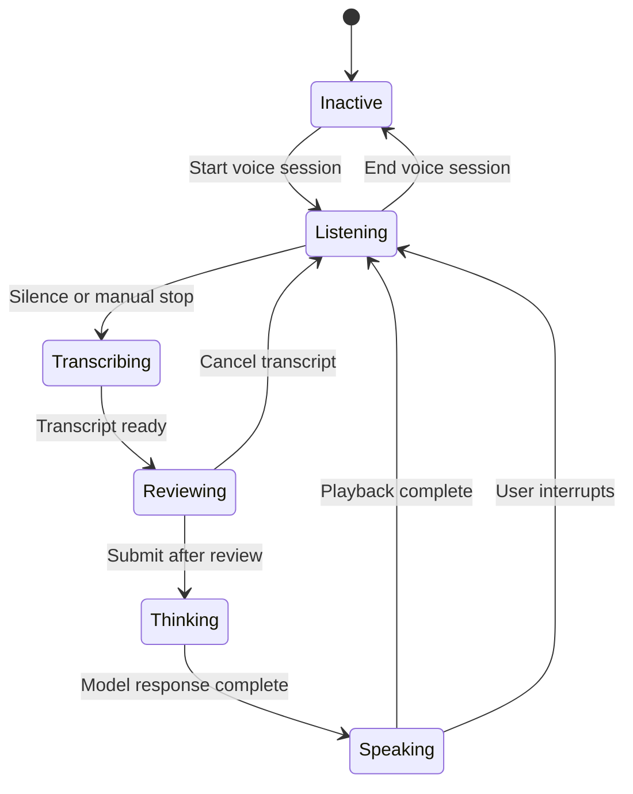

# VoicePlus Technical Specification

## Product Boundary

VoicePlus is an independent VS Code chat experience. It does not inject UI into built-in Copilot Chat, inspect built-in dictation state, or intercept another chat participant's traffic. Those capabilities are not exposed through stable extension APIs.

Version one targets stable VS Code on local Windows workspaces and is distributed privately as a VSIX from GitHub Releases.

## Agreed Behavior

- The Activity Bar sidebar and optional editor tab show the same selected conversation.
- Only one conversation may own a voice session at a time.
- The configurable shortcut opens VoicePlus and starts listening when needed.
- Silence completes a spoken turn; manual stop remains available.
- A transcript is editable for two seconds before submission. Approval phrases never use timed submission.
- VoicePlus writes its full answer in chat and speaks a concise summary by default.
- Pressing the microphone control during speech interrupts playback and starts listening.
- The model picker has an automatic fallback when a prior selection disappears.
- Microphone audio, transcription, and speech synthesis stay local.
- Read-only context retrieval is automatic and targeted. Sensitive files require explicit access.
- File changes always require approval of a displayed plan and expandable diff.
- Terminal commands require separate approval unless command auto-approve is active for that conversation.
- Command auto-approve never includes pushes, elevation, or destructive operations.
- No telemetry is collected. Audio is never persisted.

## Architecture

The extension host owns WASAPI microphone capture, silence detection, model access, conversation state, model installation, transcription, speech playback, permissions, and future workspace tools. Sidebar and editor webviews receive snapshots from one controller rather than maintaining independent conversations. Extension webviews do not request microphone permission because VS Code's stable webview permission policy does not grant `media` access.

## Voice State Machine

The microphone stream is closed before transcription, model work, and playback. This prevents VoicePlus from transcribing its own voice and keeps Windows' microphone indicator accurate.

## Local Speech

Milestone 1 uses:

- `sherpa-onnx` 1.13.5 WebAssembly runtime
- `@picovoice/pvrecorder-node` 1.2.9 with its prebuilt Windows x64 native recorder
- Moonshine Base English quantized model dated 2026-02-27
- Published archive size: 111,266,225 bytes
- Published SHA-256: `43232c1d13013d37317163baec3135bd771a186a4356f28c889bab453bb0e891`
- Windows `System.Speech.Synthesis.SpeechSynthesizer` for playback

The runtime ships inside the VSIX. The model downloads only after modal consent, is verified before extraction, and lives beneath `ExtensionContext.globalStorageUri`.

## Security Model

- Stable VS Code APIs only; no workbench DOM patching or private context keys.
- Webviews use a restrictive content security policy and local resource roots.
- Workspace Trust gates search, edits, and commands. Untrusted workspaces permit read-only chat with explicit attachments only.
- `.env`, key files, credentials, ignored files, and token-like data are excluded from automatic retrieval.
- Proposed edits are immutable approval batches. Changing a batch invalidates its approval.
- Voice approval, typed approval, and the approval button authorize only the displayed batch.
- A dedicated terminal makes commands visible. Secret prompts remain in the terminal and never enter model context.
- Conversation-scoped command auto-approve resets when the conversation or VS Code closes.
- Git pushes, elevation, and destructive commands remain outside auto-approve.

## Delivery Milestones

### Milestone 1: Voice Conversation

Status: implemented.

- Custom sidebar and expanded editor chat
- Copilot model discovery, selection, and fallback
- Streaming responses and cancellation
- Verified local speech-model installation
- Microphone capture, silence detection, and transcript review
- Spoken-summary extraction and Windows playback
- Automatic turn-taking and interruption
- VSIX-ready production bundle

### Milestone 2: Workspace Context

Status: in progress. Explicit text attachments, automatic active-editor context, and guarded read-only workspace list/search/read tools are implemented with visible source labels.

- Multiple named conversations with one voice-session owner
- Active selection and explicit file, folder, image, text, diagnostic, and terminal attachments
- Targeted file search/read tools using VS Code workspace APIs (implemented)
- Ignore rules and sensitive-file approval
- `AGENTS.md` and Copilot instruction-file discovery
- Personal instructions
- Collapsible tool activity and context audit trail
- Model capability checks and vision-model fallback
- Context compaction while preserving the visible transcript
- Optional per-workspace conversation persistence

### Milestone 3: Approved Actions

Status: implemented.

- Proposed edit batches with plain-language plans and expandable diffs (implemented)
- Voice, typed, and button approval bound to an immutable batch ID (implemented)
- Workspace edits and one-click undo where later changes do not conflict (implemented)
- Dedicated visible VoicePlus terminal with captured, collapsible output (implemented)
- Separately approved command batches and conversation-scoped auto-approve (implemented for the current single conversation)
- Dangerous-command policy and Git-specific restrictions (implemented)
- Post-edit test/build/lint proposals and result summaries (implemented through command batches)
- Explicit Stop Task behavior for models, tools, and running commands (implemented)

## Acceptance Checks

Each milestone must produce an installable VSIX and pass:

1. Type-check, lint, production bundle, and extension-host tests.
2. Light and dark theme visual checks in sidebar and editor layouts.
3. Microphone-denied, model-download-failed, no-Copilot-model, cancellation, and interrupted-speech paths.
4. A full local loop: listen, transcribe, review, stream, speak, and listen again.
5. No audio files or prompt contents in persistent logs or telemetry.